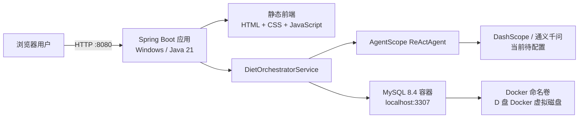
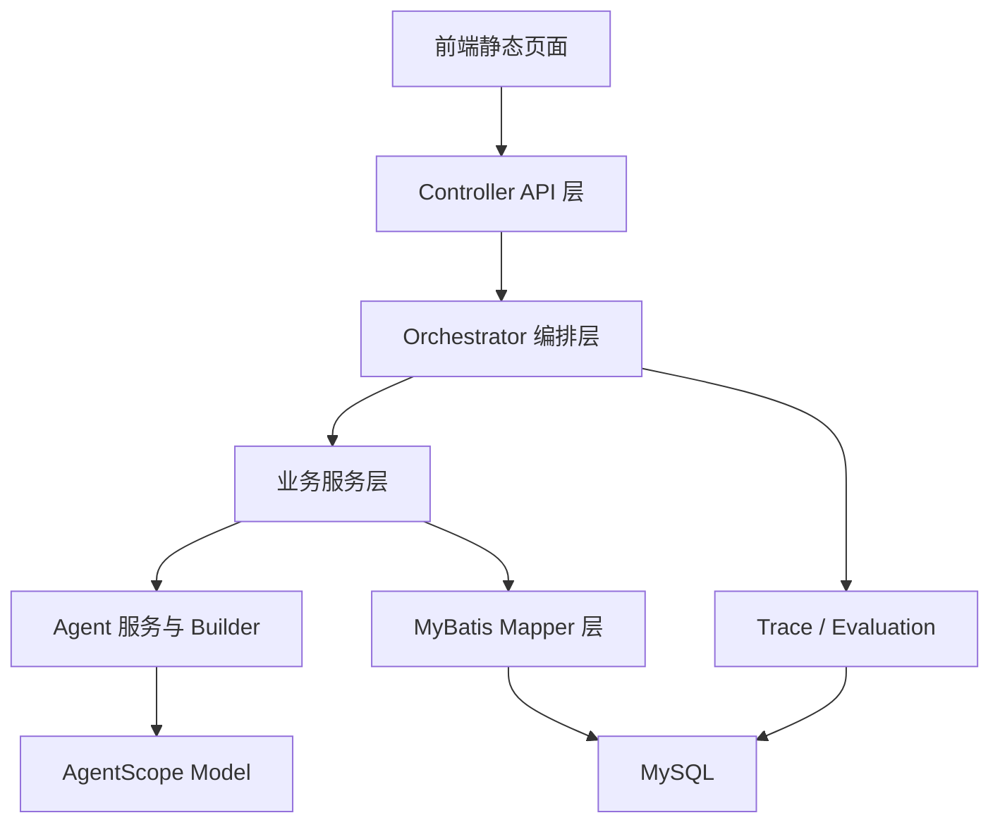
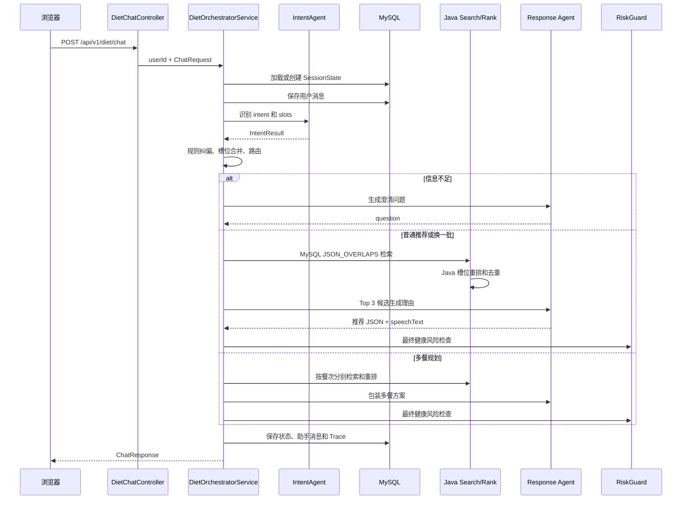
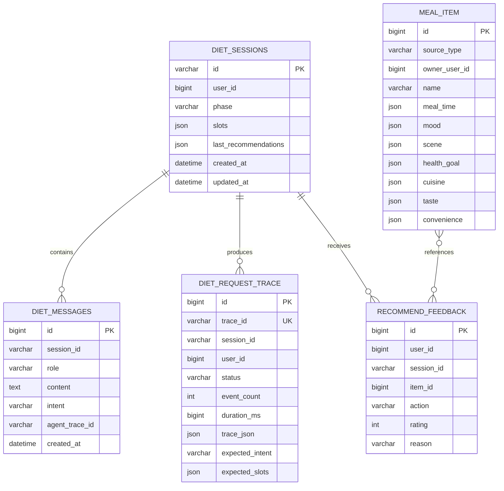

# Diet Agent 项目架构与实现说明

> 文档依据当前 `D:\学习项目\diet-agent` 源码整理。它描述的是项目现有实现，而不是抽象的示例架构。

## 1. 项目定位

Diet Agent 是一个面向饮食选择场景的多 Agent 推荐系统。它并不是让大模型直接“凭空推荐菜”，而是把任务拆成几个可控制的阶段：

1. 识别用户意图并抽取标准化标签。
2. 判断信息是否充足，不足时追问。
3. 从 MySQL 中检索真实存在的餐食。
4. 使用确定性规则重排候选。
5. 让大模型为候选生成推荐理由和自然语言回复。
6. 使用健康风险规则做最终拦截。
7. 保存会话、消息、反馈和完整 Agent Trace，用于后续评估。

这种设计的核心思想是：**数据库和 Java 规则决定“可以推荐什么”，大模型主要负责理解语言和组织表达。**

## 2. 当前运行架构



当前部署方式：

| 组件 | 运行位置 | 说明 |
|---|---|---|
| 浏览器前端 | Windows 浏览器 | 访问 `http://localhost:8080` |
| Spring Boot | Windows 本机 | Java 21，端口 8080 |
| MySQL 8.4 | Docker Linux 容器 | Windows 映射端口 3307，容器端口 3306 |
| Maven 依赖 | D 盘 | 实际位于 `D:\MavenRepository` |
| Docker 数据 | D 盘 | 位于 Docker 的 `docker_data.vhdx` 中 |

## 3. 技术栈

| 层次 | 技术 | 用途 |
|---|---|---|
| 语言与运行时 | Java 21 | 后端业务代码运行环境 |
| Web 框架 | Spring Boot 3.3.13、Spring MVC | REST API、依赖注入、内置 Tomcat |
| Agent 框架 | AgentScope Java 1.0.11 | 构建 `ReActAgent`、模型调用、Agent 内存 |
| 当前模型实现 | `DashScopeChatModel` | 调用通义千问 `qwen-max`、`qwen-turbo` |
| ORM/数据访问 | MyBatis 3.0.4 | Mapper 接口与 XML SQL 映射 |
| 数据库 | MySQL 8.4 | 会话、消息、餐食、反馈、Trace 持久化 |
| JSON | Jackson、MySQL JSON 类型 | 槽位、Trace 和推荐历史序列化 |
| 工具库 | Hutool 5.8.30 | 通用 Java 工具能力 |
| 代码简化 | Lombok | getter/setter、构造器、fluent accessor |
| 前端 | 原生 HTML/CSS/JavaScript | 单页管理界面，无 Vue/React 构建步骤 |
| 容器 | Docker Desktop、Compose、WSL 2 | 运行并持久化 MySQL 8.4 |
| 构建 | Maven 3.9.9 | 下载依赖、编译和运行 Spring Boot |

## 4. 代码分层



主要包职责：

| 目录 | 职责 |
|---|---|
| `controller` | 暴露聊天、会话、餐食、反馈、Trace、评估等 HTTP API |
| `service/orchestrator` | 一轮对话的总编排器和状态机 |
| `service/intent` | 意图识别、槽位抽取、规则纠偏 |
| `service/clarify` | 判断是否需要追问，并生成追问文案 |
| `service/meal` | 餐食 CRUD、数据库检索和 Java 重排 |
| `service/recommend` | 为单餐推荐生成理由和最终回复 |
| `service/plan` | 多餐拆分、逐餐选择和方案包装 |
| `service/risk` | 医疗、极端节食等风险规则拦截 |
| `service/session` | 会话状态与历史消息持久化 |
| `service/trace` | 收集完整请求链路和 Agent 调用信息 |
| `service/evaluation` | 规则评估、LLM Judge 和反馈加权评分 |
| `agent/builder` | 创建不同职责的 ReActAgent |
| `agent/factory` | 按 sessionId 缓存一组 Agent |
| `mapper` + `resources/mapper` | MyBatis 接口及 SQL XML |
| `model` | 请求、响应、会话、槽位、餐食、Trace 等数据对象 |
| `resources/diet/prompts` | 各 Agent 的系统提示词 |
| `resources/static` | 无构建步骤的管理前端 |

## 5. 核心领域模型

### 5.1 意图 Intent

当前代码实际定义 6 种意图：

| 意图 | 含义 | 处理分支 |
|---|---|---|
| `MEAL_RECOMMENDATION` | 普通餐食推荐 | 澄清 → 检索 → 重排 → 推荐 |
| `CLARIFY_NEEDED` | 信息不足 | 进入澄清判断 |
| `MEAL_ADJUST` | 换一批或调整上一轮推荐 | 排除历史推荐后重新检索 |
| `MEAL_PLAN` | 早中晚等多餐规划 | 按餐次拆分检索 |
| `HEALTH_RISK` | 医疗、特殊人群或极端节食风险 | 返回保守固定文案 |
| `OTHER` | 与饮食无关 | 返回固定引导文案 |

### 5.2 七维槽位 SlotBundle

| 槽位 | 示例 | 用途 |
|---|---|---|
| `mealTime` | 早餐、午餐、晚餐、三餐 | 餐次 |
| `mood` | 疲惫、开心、焦虑 | 当前心情 |
| `scene` | 工作、校园、家里、运动后 | 就餐场景 |
| `healthGoal` | 减脂、清淡、高蛋白、均衡 | 健康诉求 |
| `cuisine` | 川菜、粤菜、轻食、家常 | 菜系偏好 |
| `taste` | 辣、酸甜、咸鲜、番茄味 | 口味偏好 |
| `convenience` | 快速、一人食、适合备餐 | 便利性需求 |

合法标签来自数据库 `diet_slot_option`。LLM 输出会经过 `SlotJsonPicker` 过滤，无法映射到字典的值不会进入业务状态。

### 5.3 会话状态 SessionState

每个会话保存：

- `sessionId`：会话唯一标识。
- `userId`：数据归属用户。
- `phase`：`START`、`CLARIFY`、`RECOMMEND`、`PLAN`。
- `sourceMode`：`PERSONAL` 或 `PUBLIC`。
- `currentIntent`：当前确认意图。
- `slots`：多轮累积后的七维槽位。
- `lastRecommendations`：已推荐过的餐食 ID，用于“换一批”去重。

`sourceMode` 和 `currentIntent` 没有独立数据库列，而是放在 `diet_sessions.slots` JSON 的 `_meta` 节点中。

## 6. 多 Agent 设计

项目中的“多 Agent”不是多个自主 Agent 随意互聊，而是由 Java 编排器按固定流程调用多个专职 Agent。

| Agent | 模型 | 输入 | 输出 | 是否决定业务状态 |
|---|---|---|---|---|
| IntentAgent | 轻量模型 `qwen-turbo` | 当前输入、最近历史、已有槽位、标签字典 | `intent + slots + confidence` JSON | 否，Java 还会纠偏 |
| ClarifyAgent | 轻量模型 | 用户原话、已有槽位、缺失槽位 | 一句自然追问 | 否，是否追问由 Java 规则决定 |
| RecommendResponseAgent | 主模型 `qwen-max` | 用户输入、槽位、Java Top 3 候选 | 推荐理由和 `speechText` JSON | 否，mealId 必须来自候选 |
| PlanResponseAgent | 主模型 | 多餐候选方案 | 各餐理由和总体回复 JSON | 否，餐食由 Java 预先选定 |
| EvaluationJudgeAgent | 轻量模型 | Trace 摘要和最终回复 | 解释质量、自然度评分 | 只用于离线评估 |

`AgentFactory` 按 `sessionId + promptVersion` 缓存一套 Agent，最多保存 1000 套并按 LRU 淘汰。各业务服务在调用前会清空 Agent 内存，因此真正的长期上下文来自 MySQL 会话状态和历史消息，而不是 Agent 内部记忆。

## 7. 一轮聊天的完整链路



### 7.1 并发控制

`DietOrchestratorService` 使用 `ConcurrentHashMap<sessionId, lock>` 和 `synchronized`，保证同一个 session 的两次请求不会同时修改槽位和推荐历史。不同 session 可以并行执行。

### 7.2 意图识别与规则纠偏

IntentAgent 输出后，`IntentReviseService` 继续执行确定性规则：

- 健康风险关键词拥有最高优先级。
- 没有历史推荐时，`MEAL_ADJUST` 降级为普通推荐。
- 出现“三餐、早中晚、一周饮食”等关键词时强制进入多餐规划。
- 推荐意图置信度低于 0.4 时转为澄清。
- LLM 调用或 JSON 解析失败时，使用 Java 关键词规则兜底。

### 7.3 澄清机制

`ClarifyRuleService` 负责决定是否追问：

- `mealTime` 为空时必须追问。
- `healthGoal` 为空，且菜系、口味、场景、便利性也都不明确时，需要追问。
- 是否追问由规则决定，ClarifyAgent 只负责把缺失字段组织成自然中文。
- LLM 失败时返回模板问题。

## 8. 推荐功能实现思路

### 8.1 PERSONAL 与 PUBLIC 数据隔离

- `PERSONAL`：只查询 `source_type='PERSONAL' AND owner_user_id=userId`。
- `PUBLIC`：只查询 `source_type='PUBLIC' AND owner_user_id IS NULL`。
- 两种模式不会自动混查。
- PERSONAL 库为空时，编排器直接提示用户先维护个人餐食。

### 8.2 数据库候选召回

餐食的七维标签均保存为 MySQL JSON 数组。Mapper 使用 `JSON_OVERLAPS` 判断餐食标签是否与查询标签相交：

```sql
AND (#{tasteJson} = '[]' OR JSON_OVERLAPS(taste, #{tasteJson}))
```

各个非空槽位条件之间使用 `AND`，因此候选必须同时满足用户已经明确的各维需求。数据库层最多召回 50 条。

### 8.3 Java 重排

`MealRankService` 对七个槽位分别计算：

```text
该维度命中的查询标签数 / 用户在该维度输入的标签数
```

七维得分求和后除以 7，得到 `[0,1]` 的 `matchScore`，按分数降序取前 10 条。调整推荐时会先过滤 `lastRecommendations` 中的 ID。

### 8.4 推荐理由生成

重排后的 Top 3 才会交给 RecommendResponseAgent。Java 会再次校验 LLM 返回的 `mealId`，只接受候选集合中的 ID，避免模型编造数据库中不存在的餐食。LLM 失败或 JSON 不合法时，Java 使用模板理由和模板回复继续返回结果。

## 9. 多餐规划实现思路

`MealPlanService` 将“今天三餐”等请求拆成餐次子任务：

1. `三餐` 或未明确餐次时，展开为早餐、午餐、晚餐。
2. 为每个餐次复制共享槽位，只替换 `mealTime`。
3. 每个餐次分别进行数据库检索和 Java 重排。
4. 每餐选择 Top 1。
5. 后续餐次排除已经选择的 mealId，避免三餐重复同一道菜。
6. PlanResponseAgent 只负责生成各餐理由和整体表达。

## 10. 健康风险与可靠性

### 10.1 Risk Guard

系统在意图纠偏和最终回复两个阶段检查风险，包括：

- 医疗诊断、治疗和处方承诺。
- 绝食、只喝水等极端节食建议。
- “保证、一定能瘦、根治”等绝对化承诺。
- 孕妇、儿童、糖尿病、高血压等特殊场景。

命中规则后会丢弃原推荐回复，改成固定的保守提示。

### 10.2 多级兜底

| 失败位置 | 兜底方式 |
|---|---|
| IntentAgent 调用失败 | Java 关键词推断意图，槽位置空，置信度 0.2 |
| ClarifyAgent 失败 | Java 模板追问 |
| 推荐/规划 Agent 失败 | Java 模板理由和模板回复 |
| LLM 返回 Markdown 或额外文字 | `LlmJsonService` 截取首尾 JSON 对象再解析 |
| LLM 返回非法槽位 | `SlotJsonPicker` 按数据库字典过滤 |
| LLM 编造 mealId | 只接受 Java 候选集合中的 ID |
| 高风险回复 | Risk Guard 使用保守文案整体替换 |

## 11. Trace、人工标注与离线评估

### 11.1 Trace

每轮聊天生成一个 `trace_<uuid>`。`AgentTraceService` 使用 `ThreadLocal<TraceScope>` 收集事件，结束时把整轮事件写入 `diet_request_trace.trace_json`。

记录内容包括：

- 请求开始、结束、异常和总耗时。
- 原始意图、纠偏后意图和路由。
- 槽位合并与澄清判断。
- 数据库候选和重排结果。
- Agent 名、模型名、输入输出、调用耗时和 token 用量。
- Risk Guard 检查与最终响应。

单个 payload 最多保留 20000 字符，防止 Trace 无限膨胀。

### 11.2 人工标注

后台可以为 Trace 标注：

- 期望意图 `expectedIntent`。
- 期望槽位 `expectedSlots`。
- 期望澄清动作 `ASK/READY`。
- 标注说明。

### 11.3 评估

规则评估指标包括：意图准确率、槽位准确率、澄清准确率、token 成本、延迟、fallback、安全合规、幻觉控制和多轮一致性。

可选的 EvaluationJudgeAgent 额外评估：

- `explanationQuality`：解释质量，1～5 分。
- `naturalness`：自然度，1～5 分。

总分权重：

```text
规则指标 60% + LLM Judge 10% + 用户反馈 30%
```

某一类分数缺失时，代码会按实际存在的权重重新归一化。

## 12. 数据库设计



六张业务表：

| 表 | 用途 |
|---|---|
| `diet_sessions` | 会话阶段、累计槽位和推荐历史 |
| `diet_messages` | 用户与助手历史消息 |
| `diet_request_trace` | 每轮完整 Agent 调用链路及人工标注 |
| `diet_slot_option` | 七维槽位合法字典 |
| `meal_item` | 公共和个人餐食及 JSON 标签 |
| `recommend_feedback` | 喜欢、采纳、不合适、评分等反馈 |

## 13. HTTP API

所有需要用户身份的接口通过请求头 `X-User-Id` 获取 userId，未提供时默认为 `1`。

| 方法 | 路径 | 功能 |
|---|---|---|
| POST | `/api/v1/diet/sessions` | 创建新会话 |
| POST | `/api/v1/diet/chat` | 发送一轮聊天 |
| GET | `/api/v1/diet/slot-options` | 查询全部槽位字典 |
| GET | `/api/v1/diet/meals/personal` | 查询个人餐食 |
| POST | `/api/v1/diet/meals/personal` | 新增个人餐食 |
| PUT | `/api/v1/diet/meals/personal/{mealId}` | 修改个人餐食 |
| DELETE | `/api/v1/diet/meals/personal/{mealId}` | 删除个人餐食 |
| GET | `/api/v1/diet/meals/public` | 查询公共餐食 |
| POST | `/api/v1/diet/feedback` | 保存推荐反馈 |
| GET | `/api/v1/diet/debug/traces/{traceId}` | 查询单条 Trace |
| GET | `/api/v1/diet/debug/sessions/{sessionId}/traces` | 按会话查询 Trace |
| GET | `/api/v1/diet/debug/traces` | 按时间范围查询 Trace |
| PUT | `/api/v1/diet/debug/traces/{traceId}/label` | 人工标注 Trace |
| POST | `/api/v1/diet/evaluations` | 生成离线评估报告 |

聊天请求示例：

```json
{
  "sessionId": "sess_xxx",
  "message": "晚餐想吃清淡一点的",
  "sourceMode": "PUBLIC",
  "context": {}
}
```

返回类型分为：

- `ANSWER`：文本回复，可带餐食卡片。
- `CLARIFY`：追问回复，包含 `missingSlots`。

## 14. 前端实现

前端位于 `src/main/resources/static`，由 Spring Boot 直接作为静态资源提供，无需 Node.js 或 npm。

- `index.html`：页面外壳、导航和用户 ID 输入。
- `assets/js/api.js`：统一封装 fetch、`X-User-Id` 和错误解析。
- `assets/js/app.js`：基于 URL Hash 的单页路由和全部页面逻辑。
- `assets/css/app.css`：页面样式。

现有页面功能：

- 首页统计。
- 推荐聊天及 PERSONAL/PUBLIC 模式切换。
- 个人餐食新增、修改、删除。
- 公共餐食浏览。
- 推荐反馈按钮。
- Trace 查询、查看和人工标注。
- 离线评估报告。

前端将 userId 保存在 `localStorage`，这只是本地演示机制，不是真实登录认证。

## 15. 配置与环境

主要配置文件：`src/main/resources/application.yml`。

```text
Spring Boot 端口：8080
Docker MySQL：localhost:3307/diet_db
主模型：qwen-max
轻量模型：qwen-turbo
最大历史消息数：10
```

数据库连接支持环境变量覆盖：

- `DB_URL`
- `DB_USERNAME`
- `DB_PASSWORD`

Docker 环境由项目根目录 `compose.yaml` 管理，初始化 SQL 位于 `src/main/resources/db/diet_db.sql`。初始化 SQL 只在数据卷第一次创建时自动执行。

## 16. 当前实现的注意点与改进方向

### 16.1 DeepSeek 尚未适配

当前 `DietAgentScopeConfig` 直接创建 `DashScopeChatModel`，模型名也是 `qwen-max/qwen-turbo`。DeepSeek API Key 不能直接填入 `agentscope.dashscope.api-key`。需要把 Model Bean 改为支持 OpenAI 兼容接口的实现，并配置 DeepSeek base URL、模型名和环境变量。

### 16.2 API Key 不应写死

当前配置仍是 DashScope Key 占位值。正式使用时应改为环境变量，例如 `DASHSCOPE_API_KEY` 或未来的 `DEEPSEEK_API_KEY`，避免密钥提交到源码。

### 16.3 全局异常处理包名有误

`DietExceptionHandler` 当前配置：

```java
@RestControllerAdvice(basePackages = "com.diet.newdiet")
```

实际 Controller 位于 `com.diet.controller`。因此该 Advice 很可能无法覆盖当前接口，应改为 `com.diet` 或 `com.diet.controller`。

### 16.4 当前没有真实认证

`X-User-Id` 默认值为 1，任何调用方都可以指定其他 userId。这适合学习演示，不适合生产环境。生产版需要登录认证、授权和管理接口隔离。

### 16.5 内存锁的生命周期

Agent 缓存有 1000 条 LRU 上限，但 `DietOrchestratorService.sessionLocks` 没有清理机制。长时间产生大量 session 时可能持续增长，可以在会话结束或超时后清理。

### 16.6 数据库结构可进一步规范化

- `sourceMode/currentIntent` 当前嵌入 `slots._meta`，可考虑独立列。
- `recommend_feedback` 没有 `trace_id`，评估时只能把同 session 的反馈近似归因给多条 Trace。
- JSON 标签检索方便演示，但数据量大时应评估生成列、索引或倒排结构。

### 16.7 工程化能力

当前源码没有实际测试用例。建议补充：

- Intent 纠偏和澄清规则单元测试。
- MealRankService 排序测试。
- MyBatis JSON_OVERLAPS 集成测试。
- Orchestrator 各路由测试。
- LLM Mock 和 fallback 测试。
- Risk Guard 安全用例。

## 17. 推荐的学习顺序

1. 从 `DietChatController` 理解 HTTP 入口。
2. 阅读 `DietOrchestratorService`，掌握一轮对话状态机。
3. 阅读 `IntentAgentService` 和 `IntentReviseService`，理解 LLM 与规则混合决策。
4. 阅读 `SessionStateService`，理解多轮状态如何落库。
5. 阅读 `MealMapper.xml`、`MealService` 和 `MealRankService`，理解检索与重排。
6. 阅读 `RecommendResponseAgentService`，理解如何约束 LLM 不编造候选。
7. 阅读 `RiskGuardService` 和 `AgentTraceService`，理解安全与可观测性。
8. 最后阅读 `EvaluationService`，理解如何建立 Agent 系统的评估闭环。

## 18. 总结

该项目采用的是一种“确定性业务流水线 + 专职 LLM Agent”的混合架构：

- Java Orchestrator 控制状态、路由和副作用。
- MySQL 提供真实候选与长期会话记忆。
- Java 规则负责澄清、安全、重排和兜底。
- LLM Agent 负责自然语言理解、理由生成和表达优化。
- Trace、人工标注、反馈与 Evaluation 形成可观测和可评估闭环。

这种架构比“一个 Prompt 解决所有问题”复杂，但更容易控制幻觉、复现问题、保护数据边界，并适合学习生产型 Agent 系统的基本设计方式。
