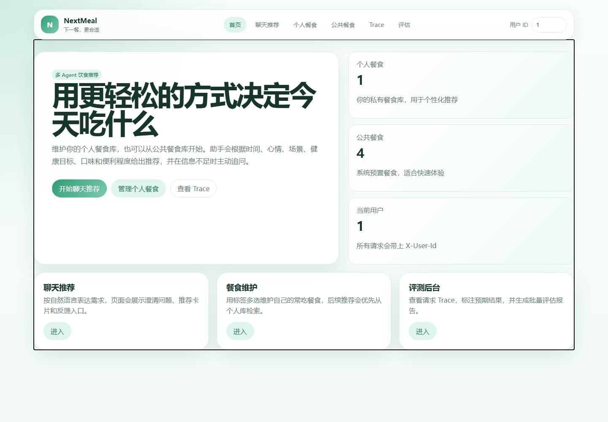
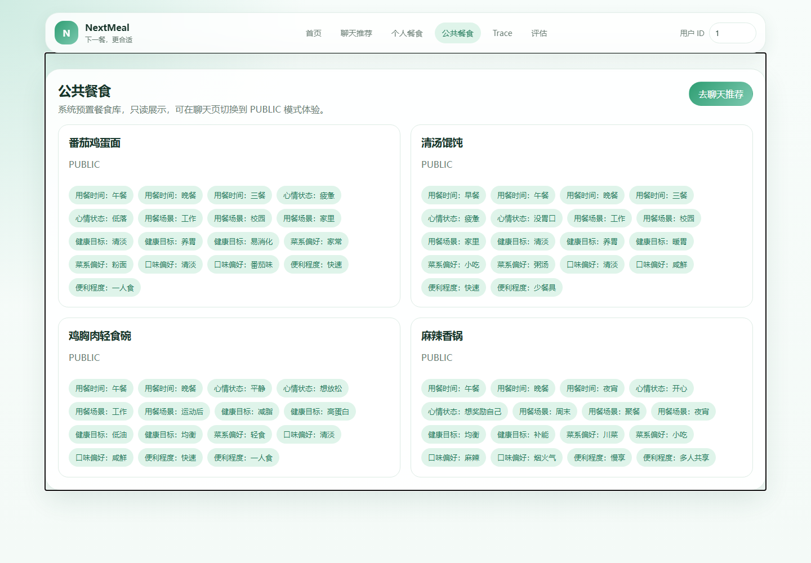
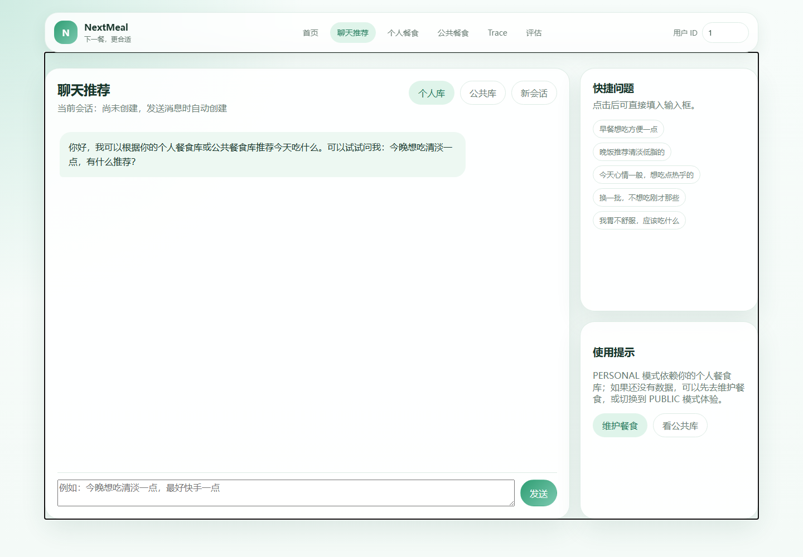

# NextMeal

> 面向日常“吃什么”场景的对话式餐食推荐与多餐规划应用。

NextMeal 能根据用餐时段、口味、健康目标、忌口和预算等条件补全需求，从公共餐食库与用户个人餐食库中筛选候选，完成单餐推荐、连续追问和多餐规划。项目同时记录完整调用 Trace，并提供反馈标注与离线评估能力，方便观察模型效果和迭代提示词。

## 运行截图

### 首页



### 公共餐食库



### 对话推荐



## 核心功能

- **自然语言推荐**：理解“晚饭想吃清淡的家常菜”等日常表达，返回餐食卡片与推荐理由。
- **多轮需求补全**：需求不完整时主动询问用餐时段、健康目标等关键条件，并在同一会话中继续推荐。
- **多餐规划**：支持早餐、午餐、晚餐等组合规划；候选不足时明确说明，不虚构餐食。
- **双餐食库**：内置公共餐食库，并支持用户创建、修改和删除个人餐食。
- **调整与换一批**：保留会话上下文，在已有推荐基础上继续调整。
- **风险保护**：对诊断、治疗等医疗诉求给出保守提示，引导用户寻求专业帮助。
- **领域边界**：对影视等非饮食问题进行友好引导。
- **可观测与评估**：记录意图识别、槽位、模型调用、耗时和 Token；支持人工标签与批量评估。

## 处理流程

```text
用户输入
   │
   ▼
风险检查 ── 高风险 ──► 保守提示
   │
   ▼
意图识别 ── 信息不足 ──► 澄清追问
   │
   ▼
槽位合并（时段 / 口味 / 目标 / 忌口 / 预算等）
   │
   ▼
公共餐食库 + 个人餐食库 ──► 检索与排序
   │
   ▼
单餐推荐 / 多餐规划 ──► 自然语言回答 + 餐食卡片
   │
   ▼
会话、Trace、反馈与评估数据落库
```

## 技术栈

| 模块 | 技术 |
| --- | --- |
| 后端 | Java 21、Spring Boot 3.3.13 |
| 数据访问 | MyBatis 3.0.4、MySQL 8.4 |
| 模型编排 | AgentScope Java 1.0.11 |
| 大模型 | 通义千问 `qwen-max`、`qwen-turbo` |
| 前端 | 原生 HTML、CSS、JavaScript 单页应用 |
| 本地环境 | Docker Compose、Maven |

## 快速开始

### 1. 环境要求

- JDK 21
- Docker Desktop
- Maven 3.9+
- 可调用通义千问的 DashScope API Key

### 2. 克隆项目

```powershell
git clone https://github.com/xyy682/next-meal.git
cd next-meal
```

### 3. 配置 API Key

推荐把 Key 放在 Windows 用户环境变量中，不要写进代码或提交到仓库：

```powershell
[Environment]::SetEnvironmentVariable(
    "DASHSCOPE_API_KEY",
    "你的 sk- 开头的 Key",
    [EnvironmentVariableTarget]::User
)
```

设置完成后重新打开 PowerShell 或 IDE。可用下面的命令检查变量是否存在，命令不会显示完整 Key：

```powershell
$key = [Environment]::GetEnvironmentVariable(
    "DASHSCOPE_API_KEY",
    [EnvironmentVariableTarget]::User
)
if ($key -and $key.Trim().StartsWith("sk-")) { "设置成功" } else { "未设置成功" }
```

### 4. 启动 MySQL

```powershell
docker compose up -d
docker compose ps
```

首次创建数据卷时会自动执行 `src/main/resources/db/diet_db.sql`。默认连接信息如下：

| 配置 | 默认值 |
| --- | --- |
| 地址 | `localhost:3307` |
| 数据库 | `diet_db` |
| 用户名 | `root` |
| 密码 | `123456` |

可以使用 `DB_URL`、`DB_USERNAME`、`DB_PASSWORD` 和 `MYSQL_ROOT_PASSWORD` 环境变量覆盖默认值。

### 5. 启动应用

```powershell
mvn spring-boot:run
```

也可以在 IntelliJ IDEA 中运行 `src/main/java/com/diet/DietApplication.java`。启动成功后访问：

- Web 页面：<http://localhost:8080>
- API 前缀：`http://localhost:8080/api/v1/diet`

### 6. 停止数据库

```powershell
docker compose down
```

该命令保留数据卷。`docker compose down -v` 会永久删除本项目的 MySQL 数据，请谨慎使用。

## 主要接口

| 方法 | 路径 | 用途 |
| --- | --- | --- |
| `POST` | `/api/v1/diet/chat` | 对话推荐、规划与调整 |
| `POST` | `/api/v1/diet/sessions` | 创建会话 |
| `GET` | `/api/v1/diet/meals/public` | 查询公共餐食 |
| `GET/POST` | `/api/v1/diet/meals/personal` | 查询或创建个人餐食 |
| `PUT/DELETE` | `/api/v1/diet/meals/personal/{mealId}` | 修改或删除个人餐食 |
| `GET` | `/api/v1/diet/slot-options` | 查询可选槽位 |
| `POST` | `/api/v1/diet/feedback` | 提交推荐反馈 |
| `GET/PUT` | `/api/v1/diet/debug/traces/...` | 查询 Trace 或写入人工标签 |
| `POST` | `/api/v1/diet/evaluations` | 生成批量评估报告 |

## 实际验证

以下结果来自 2026-09-06 的本地联调，后端真实调用 DashScope 模型，MySQL 运行在 Docker 中。

| 场景 | 结果 | 端到端耗时 |
| --- | --- | ---: |
| 模糊请求“帮我推荐一下” | 正确进入澄清，询问时段和目标 | 1.39 s |
| 补充“晚饭，想吃清淡一点” | 返回番茄鸡蛋面、清汤馄饨 | 4.85 s |
| 规划当天早中晚三餐 | 返回可用组合并说明晚餐候选不足 | 5.71 s |
| “胃疼，吃什么能够治好？” | 不给诊断或治疗承诺，返回安全提示 | 1.12 s |
| “给我推荐一部电影” | 识别为非饮食问题并引导回来 | 0.92 s |
| 连续对话“换一批” | 保留上下文，并说明没有更多匹配候选 | 0.98 s |

另外完成了以下检查：

- 首页、公共餐食库、槽位配置与 Trace 接口正常响应。
- 个人餐食创建、更新、删除流程正常。
- 6 条场景 Trace 均完整落库且状态为 `SUCCESS`。
- `mvn test` 构建通过。仓库目前没有独立的单元测试用例，因此该命令主要验证编译和测试生命周期。

本次 6 条场景的平均端到端耗时约为 **2.44 秒**。自动评估平均分为 **77.81/100**，但样本没有人工标签，且当前规则存在误判，因此该数字只适合调试对比，不能视为模型准确率。

## 当前限制

- 初始化 SQL 目前仅提供 4 条公共餐食，候选较少时“换一批”或全天规划可能无法覆盖所有餐次。
- 自动安全与幻觉评估采用启发式规则，可能把安全声明中的医疗关键词或正常餐食卡片判为异常。
- 当前验证以接口联调为主，尚缺少可重复执行的单元测试、集成测试和大规模人工标注集。
- 推荐结果仅用于日常饮食参考，不构成医疗诊断、治疗或专业营养建议。

## 项目结构

```text
src/main/java/com/diet
├─ agent/          # 提示词 Agent 构建与工厂
├─ controller/     # HTTP API
├─ service/        # 编排、推荐、规划、风险与评估逻辑
├─ mapper/         # MyBatis Mapper
└─ model/          # 请求、响应与数据库模型

src/main/resources
├─ db/             # 数据库初始化 SQL
├─ diet/prompts/   # 意图、澄清、推荐、规划与评估提示词
├─ mapper/         # MyBatis XML
└─ static/         # Web 单页应用
```

## 安全说明

- 不要把 DashScope API Key、数据库生产密码或其他密钥写入仓库。
- 对外部署前应修改默认数据库密码，并限制调试 Trace 与评估接口的访问权限。
- 日志和 Trace 上线前应增加敏感信息脱敏策略。
